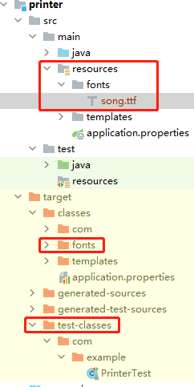

> 背景： maven项目中main的resources和test的resources目录是分开的，但是有时候我们有一个大文件如：字体文件，想放到resources目录下，在main中一切ok，但是在test中写单元测试是却提示：file not found.因为是找了tests-classes下的资源所以没法找到。但是如果放两份的话仓库又较大。所以需要合并。
1. 在main下的resources下添加文件
2. 在pom.xml中配置
```xml
<build>
    <testResources>
      <testResource>
        <directory>${project.basedir}/src/test/resources</directory>
      </testResource>
      <testResource>
        <directory>${project.basedir}/src/main/resources</directory>
      </testResource>
    </testResources>
</build>
```
3. 代码
```java
// main/*.java
// load file from /src/test/resources
ClassLoader classLoader = Class.forName("com.example.Printer").getClassLoader();
System.out.println(classLoader.getResource("fonts/song.ttf").getPath());
File fontFile = new File(classLoader.getResource("fonts/song.ttf").getPath());
```
需要注意，资源中不能有中文，否则也会出现file not found。
4. 测试ok
```shell
//output 可以看到没有去test-classes目录去找文件
printer/target/classes/fonts/song.ttf
```
5. 目录结构



[参考](https://stackoverflow.com/questions/18977959/junit-test-should-use-main-resources)

