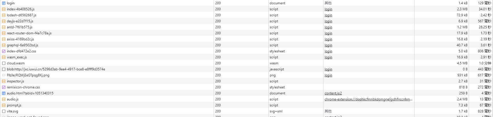
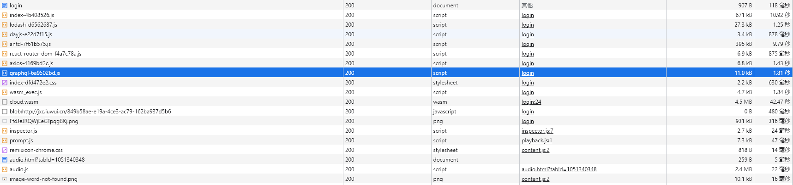

> 使用vite构建reactjs项目，在部署是需要优化，以提高加载速度。
# nginx优化
开启gzip和静态文件缓存
```nginx.conf
server {
    listen       80;
    server_name  localhost;
    gzip on;
    gzip_comp_level 5;
    gzip_min_length 1k;
    gzip_buffers 4 16k;
    gzip_proxied any;
    gzip_vary on;
    gzip_static on;
    gzip_types
        application/javascript
        application/x-javascript
        text/javascript
        text/css
        text/xml
        application/xhtml+xml
        application/xml
        application/atom+xml
        application/rdf+xml
        application/rss+xml
        application/geo+json
        application/json
        application/ld+json
        application/manifest+json
        application/x-web-app-manifest+json
        image/svg+xml
        text/x-cross-domain-policy;
        # application/wasm; 
    gzip_disable "MSIE [1-6]\.";

    #access_log  /var/log/nginx/host.access.log  main;
    root   /usr/share/nginx/html;
    location / {
        index  index.html index.htm;
        try_files $uri /index.html;
        #try_files $uri $uri/ /index.html;
    }

    #error_page  404              /404.html;

    # redirect server error pages to the static page /50x.html
    #
    error_page   500 502 503 504  /50x.html;
    location = /50x.html {
        root   /usr/share/nginx/html;
    }
    # 缓存图片
    location ~* ^.+\.(ico|gif|jpg|jpeg|png)$ {
      access_log   off;
      expires      30d; #根据自己需要修改时间
    }

    #缓存js、css、视频文件
    location ~* ^.+\.(css|js|txt|xml|swf|wav)$ {
      access_log   off;
      expires      30d;
    }

    # 缓存html类型文件        开启后会导致404
    location ~* ^.+\.(html|htm)$ {
      expires      1h;
    }

    # 缓存字体文件，配合gzip更好
    location ~* ^.+\.(eot|ttf|otf|woff|svg)$ {
      access_log   off;
      expires 30d;
    }
}

```
[nginx配置参考1：http://www.yaohaixiao.com/blog/how-to-configure-gzip-compression-with-nginx/](http://www.yaohaixiao.com/blog/how-to-configure-gzip-compression-with-nginx/)\
[nginx配置参考2：https://juejin.cn/post/6982757068587565064](https://juejin.cn/post/6982757068587565064)\

这里需要注意几点：
1. 虽然nginx的mime.type里存在wasm，但是需要一个单独的模块(brotli)支持，需要重新编译nginx，[参考：https://blog.51cto.com/u_15127692/3926362](https://blog.51cto.com/u_15127692/3926362)
2. 如果nginx配置不熟悉，在开启了静态文件缓存后会出现404，因为location是单独的，所以后面静态文件没有root指向，导致404。

优化前的速度

优化后的速度

# vite优化
```js
export default defineConfig({
  plugins: [react()/*,splitVendorChunkPlugin()*/],
  define: {
    'process.env.POLYGON_CLIPPING_MAX_QUEUE_SIZE': '1000000',
  },
  test: {
    globals: true,
    environment: 'happy-dom',
  },
  build: {
    rollupOptions: {
      output: {
        /**
         * 1.以对象的方式使用
         * 将 lodash 模块打包成一个 chunk，名称是 lodash
         */
        manualChunks: {
          lodash: ['lodash'],
          dayjs: ['dayjs'],
          antd: ['antd'],
          axios: ['axios'],
          react: ['react'],
          'react-dom': ['react-dom'],
          'react-router-dom': ['react-router-dom'],
          graphql: ['graphql'],
          mathjs: ['mathjs'],
          'rc-resize-observer': ['rc-resize-observer'],
          '@apollo/client': ['@apollo/client'],
          '@ant-design/charts': ['@ant-design/charts'],
          '@ant-design/icons': ['@ant-design/icons'],
          '@ant-design/pro-components': ['@ant-design/pro-components'],
        },
	}
}
```
在vite.config.ts中配置`build.rollupOptions.output`将项目中用到的第三方模块都拆分出去。\
拆分前build（）：
```bash
vite v4.4.0 building for production...
✓ 9821 modules transformed.
dist/index.html                     0.69 kB │ gzip:     0.45 kB
dist/assets/index-51e7f7b4.css      4.81 kB │ gzip:     1.84 kB
dist/assets/index-de6e8207.js   3,723.02 kB │ gzip: 1,111.65 kB
```
拆分后build:
```bash
vite v4.4.0 building for production...
✓ 9821 modules transformed.
dist/index.html                                         1.69 kB │ gzip:   0.66 kB
dist/assets/index-51e7f7b4.css                          4.81 kB │ gzip:   1.84 kB
dist/assets/react-dom-b0411d30.js                       0.03 kB │ gzip:   0.05 kB
dist/assets/react-b0411d30.js                           0.03 kB │ gzip:   0.05 kB
dist/assets/rc-resize-observer-78ba4040.js              2.41 kB │ gzip:   1.15 kB
dist/assets/dayjs-e2f20e45.js                           6.62 kB │ gzip:   2.99 kB
dist/assets/react-router-dom-5306583a.js                9.51 kB │ gzip:   3.89 kB
dist/assets/axios-65e928e0.js                          16.56 kB │ gzip:   6.39 kB
dist/assets/@ant-design/icons-0e1b1c01.js              18.31 kB │ gzip:   6.40 kB
dist/assets/graphql-20a0908f.js                        39.59 kB │ gzip:  10.15 kB
dist/assets/lodash-ba8bf10b.js                         72.54 kB │ gzip:  26.74 kB
dist/assets/@apollo/client-b155eae9.js                135.44 kB │ gzip:  41.34 kB
dist/assets/index-97adcbda.js                         149.75 kB │ gzip:  31.19 kB
dist/assets/@ant-design/pro-components-f9c5a6e3.js    519.66 kB │ gzip: 158.12 kB
dist/assets/mathjs-33ff2e22.js                        605.84 kB │ gzip: 174.76 kB
dist/assets/@ant-design/charts-3c57e99a.js            901.62 kB │ gzip: 266.27 kB
dist/assets/antd-4e1b85e4.js                        1,220.77 kB │ gzip: 381.92 kB
```
这里我们第三方模块拆分开，我们的index-hash.js从3.7M减少到了4.81kB。
# 使用CDN引入第三方模块
TODO