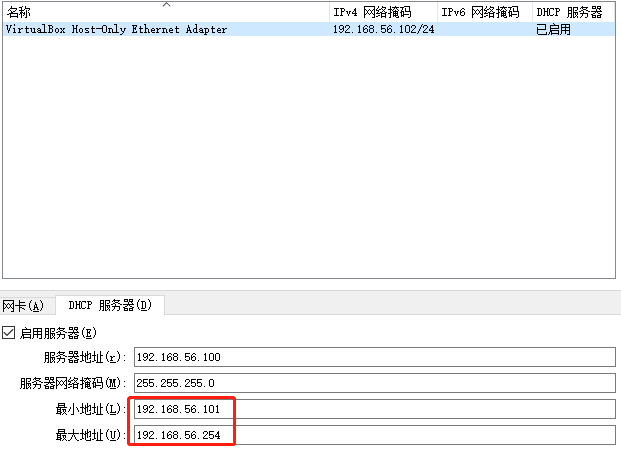

> 新建的虚拟机默认是NAT网络，主机无法访问，如果需要在主机访问虚拟机中的web服务，需要新增一个网卡


新建的虚拟机默认是NAT网络，主机无法访问，如果需要在主机访问虚拟机中的web服务

1. 虚拟机新增一个网卡选择Host-Only模式
2. 在虚拟机中安装net-tool工具（否则无法使用ifconfig命令）
3. 默认新增加的网卡是down状态，启用他
```bash
sudo ifconfig eth0s8 up #查看新增加的网卡名称(ip addr)，我这里是eth0s8
#再次查看网络状态，是up状态，但是网络地址是ipv6格式的

```
4. 通过virtual box“全局设定”-“网络管理工具”查看里面启用的ip（ipv4）地址段查看可分配的ip地址，如：192.168.56.106


5. 开启ssh（参考另一篇文章）
6. 防火墙开启22和80端口
```bash
sudo ufw allow 22
sudo ufw allow 8080
```
[防火墙参考 https://ubuntu.com/server/docs/security-firewall](https://ubuntu.com/server/docs/security-firewall)
7. 虚拟机增加ip
```bash
sudo ip addr add 192.168.56.106/24 dev enp0s8
sudo ip link set enp0s8 dev down
sudo ip link set enp0s8 dev up
```
[配置网络参考 https://ubuntu.com/server/docs/network-configuration](https://ubuntu.com/server/docs/network-configuration)
8. 主机telnet虚拟机`telnet 192.168.56.106`
10.  ssh测试 `ssh user@192.168.56.106` ，提示输入密码即表示配置成功
11.  测试web服务
	1. 虚拟机开启一个http服务
```bash
python3 -m http.server 8080
```
12. 主机访问测试
13. 拷贝主机生产的文件到虚拟机
```bash
scp ./dist user@192.168.56.106:/home/user/app/frontend/
```
[SCP Example https://haydenjames.io/linux-securely-copy-files-using-scp/](https://haydenjames.io/linux-securely-copy-files-using-scp/)

14. docker-compose运行多个command
```bash
...
service:
	...
	command: bash -c "python manage.py migrate && python manage.py runserver 0.0.0.0:8000"
	...
```
15. reactjs dockerize
nginx config
```conf
server {
 listen 80;
 
 location / {
   root /usr/share/nginx/html/;
   include /etc/nginx/mime.types;
   try_files $uri $uri/ /index.html;
 }
}
```
[reactjs nginx配置 https://www.geeksforgeeks.org/how-to-dockerize-a-reactjs-app/](https://www.geeksforgeeks.org/how-to-dockerize-a-reactjs-app/)

[Reference https://www.cnblogs.com/Reyzal/p/7743747.html](https://www.cnblogs.com/Reyzal/p/7743747.html)